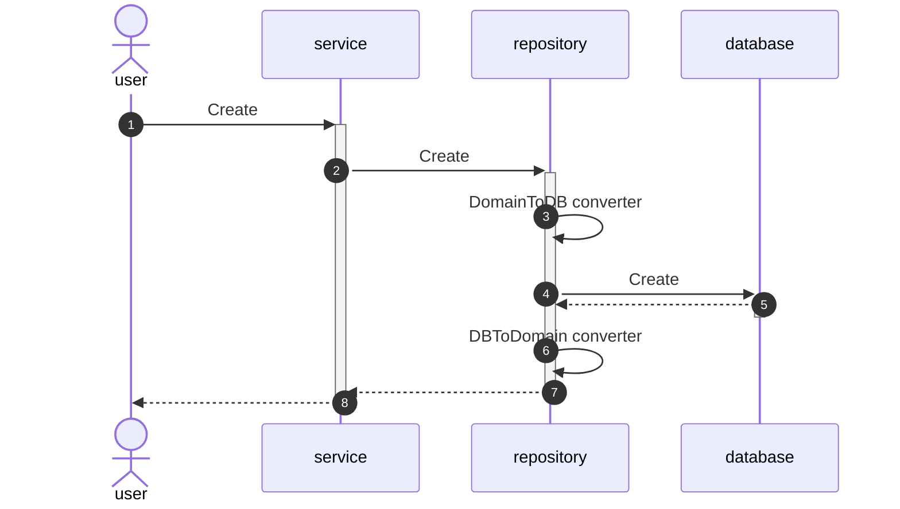
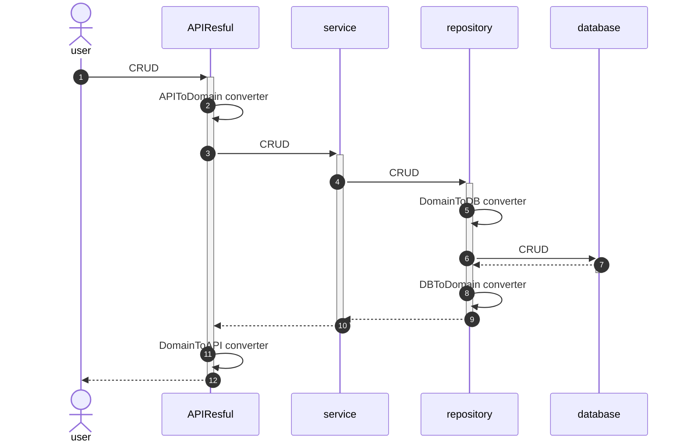

# 📚 Bookstore
This project pretends to be a little microservice app for a bookstore and use the best practices that I know right now.

## 📌 Milestones

### 🟢 Milestone I
- Project scaffolding
  - Domain driven design (since my point of view 😀)
  - Ports and adapter pattern (aka hexagonal architecture)
- Database persistence
- Tests
  - Mock tests
  - Cucumber tests
  - Use of TestContainers
#### Little functionality diagram


### 🟠 Milestone II
__We are in this step right now__
- RESTful
  - Based on OpenAPI specification
  - Oapi-codegen to generate code from OpenAPI specification
  - Echo web framework
#### Little functionality diagram

### 🔴 Milestone III
- Message broker
  - Kafka
  
### 🔴 Milestone IV
- Cache
  - Redis

### 🔴 Milestone VI
- Metrics
  - Prometheus
  - Grafana

## 🏁 How to run it
### 📝 Install the necessary libraries
  ```shell
  go get -u github.com/rs/zerolog/log                                                 # Logs
  go get -u gorm.io/gorm                                                              # ORM
  go get -u gorm.io/driver/postgres                                                   # ORM
  go get -u github.com/golang/mock/mockgen                                            # Testing 
  go get -u github.com/stretchr/testify                                               # Testing
  go get -u github.com/DATA-DOG/go-sqlmock                                            # Testing
  go get -u github.com/cucumber/godog                                                 # Testing
  go get -u github.com/testcontainers/testcontainers-go                               # Testing
  go get -u -d github.com/golang-migrate/migrate                                      # Utils
  go install -tags 'postgres' github.com/golang-migrate/migrate/v4/cmd/migrate@latest # Utils
  go get -u github.com/spf13/viper                                                    # Utils
  go get -u github.com/google/uuid                                                    # Utils
  go get -u github.com/deepmap/oapi-codegen                                           # Utils
  go get github.com/invopop/validation                                                # Utils
  go get -u github.com/labstack/echo                                                  # Web
  ```
### 🔥 Run the makefile
```shell
make databases-up       # Databases are initialized
```
```shell
make databases-populate # Databases are populated
```
```shell
make build              # Build the apps 
```
```shell
make clean              # Cleans all
```
